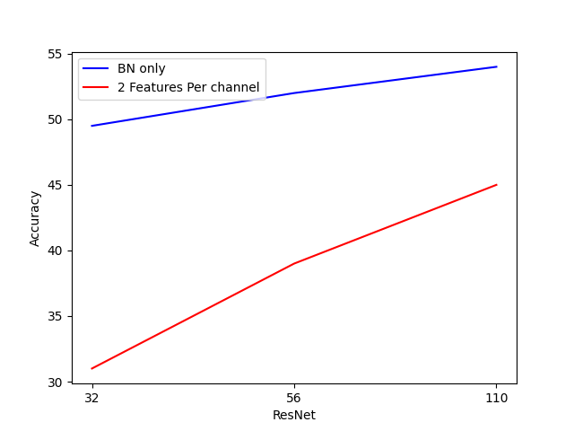
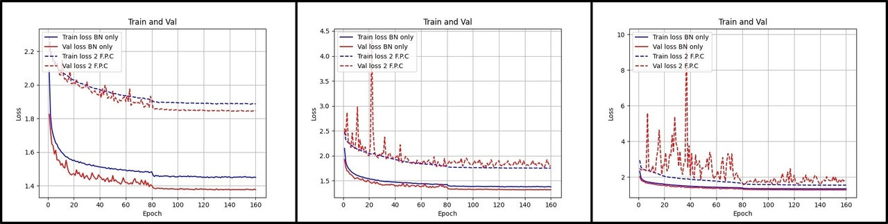
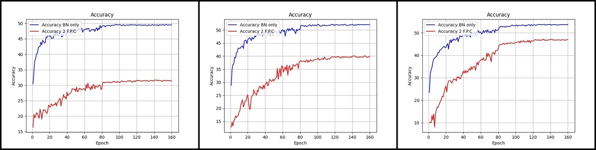

# Training BatchNorm and only BatchNorm

Эта реализация оригинальной статьи https://arxiv.org/pdf/2003.00152.pdf показывает возможность обучения CIFAR10 при помощи рандомно ициализированных весов и только при помощи них.

В оригинальной статье предложено сравнение точности полученной модели на различных архитектурах:
 <ul>
 <li>ResNet(N), где N принадлежит (14, 32, 56, 110, 218, 434, 866) </li>
 <li>ResNet14-W, где W принадлежит (1, 2, ,4 ,8, 16, 32)</li>
 <li>VGG</li>
 </ul>
  
И при различных обучаемых параметрах:
<ul>
    <li>Обучение только BatchNorm </li>
    <li>Обучение всех параметров модели</li>
    <li>Обучение рандомно взятых параметров сверточных слоев (кол-во пропорционально BN параметрам)</li>
</ul>

В данной реализации рассмотрены только ResNet<32, 56, 110> для сравнения BN-only с пропорциональным колличестом 
рандомных параметров сети.
При обучении использовалось <b> 160</b> эпох , Начальная скорость обучения <b>0.1</b> с понижением <b>gamma=0.1</b> 
на шагах <b>80 и 120</b>. Опимизатор <b>SGD с импульсом 0.9</b>. Размер батча: <b>128</b>

Увеличение глубины способствует приросту качества из-за увелечения общего числа обучаемых параметров. 
Но даже при увеличении глубины BN параметры не занимают больше 0.5% сети и при этом дают относительно хорошее качество
<table>
<tr>
<td>
</td>
<td>
<b>ResNet32</b>
</td>
<td>
<b>ResNet56</b>
</td>
<td>
<b>ResNet101</b>
</td>
</tr>
<tr>
<td>
<b>Total Params</b>
</td>
<td>
467194
</td>
<td>
856058
</td>
<td>
1731002
</td>
</tr>
<tr>
<td>
<b>BN Trainable</b>
</td>
<td>
2272
</td>
<td>
4064
</td>
<td>
8096
</td>
</tr>
<tr>
<td>
<b>%</b>
</td>
<td>
0.49%
</td>
<td>
0.48%
</td>
<td>
0.47%
</td>
</tr>
</table>
 
<b>Сравнение качества ResNet с различной глубиной:</b> 

 
 
Как можно заметить, обучение только BN даёт более хорошее качество по сравнению с рандомными параметрами сети (2 F.P.C).
Такое поведение,вероятно, обусловленно тем, что обучаются слои целиком, нежели отдельные параметры слоев

<b>Train и Val Loss с различной глубиной и разными параметрами:</b> 
  
<b>Accuracy с различной глубиной и разными параметрами:</b> 

<h2> Выводы </h2>
Результаты показывают, что возможно достич относительно не плохого качества обучая только афинные параметры
батч нормализации, при этом заморозив все остальные веса в первоначальном виде. Сами по себе эти параметры дают больший
прирост качества, чем использование такого же кол-ва параметров, взятых из всех слоев модели

<h4>Заметные плюсы<h4>
<ul>
<li>Возможность хранить random seed инциализации и веса BN, что уменьшит стоимость хранения данных</li>
<li>Понижение требовательности к памяти во время обучения -> возможность использовать больший Batch Size</li>
</ul>
<h4>Заметные минусы</h4>
<ul>
<li>Низкое качество по сравнению с полной моделью</li>
</ul>

<h1>Запуск кода</h1>
<ol>
<li>
<code>
pip3 install -r requirements.txt
</code>
</li>
<li>
<code>
source run_train.sh
</code>
</li>
</ol>

